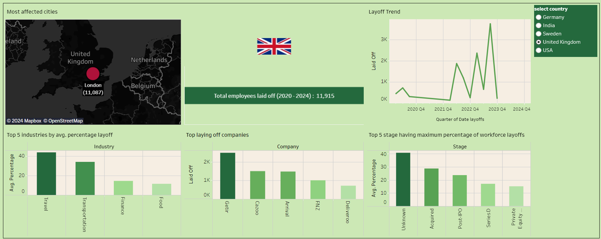

# Tech Layoffs (2020-2024)

* Done a study to analyze trend of layoffs in tech industry in 5 most affected countries due to COVID-19 and economic slowdown during (2020-2024).
* The dashboard shows various metrics showcasing the impact of layoffs on the different countries including India.
* Dashboard: https://public.tableau.com/app/profile/varsha.menani/

## About the Dataset
Data is from https://layoffs.fyi/
Web scraping on Dec. 25th 2023 + Jan 14th 2024
The dataset is available on kaggle : https://www.kaggle.com/datasets/ulrikeherold/tech-layoffs-2020-2024 

## Dashboard
US             |  INDIA
:-------------------------:|:-------------------------:
  |  
**UK**           |  **GERMANY**
  |  

## Insights
* US had maximum number of laid off employees followed by India, Germany, Sweden, and UK.
* US and other european countries were most affected during 2022-Q4 due to economy slowdown.
* Whereas India was most hit during 2020-Q2 due to COVID-19 breakdown.
* Travel is the most affected industry in US and UK due to strict travel restrictions during COVID.
* Whereas Germany's travel industry shown some resilence due to revenge travel post pandemic
  but retail was most affected due to rising inflation caused by various factors, Russia - Ukrain war being one of the those factors.
* In India, Education industry had seen maximum layoffs due to poor financial decisions by major Edtech companies like BYJUs and Unacademy.
* Tech gaints like Amazon, Meta and google were among the major contributers in layoffs
  as the sector confronts a whiplash in pandemic-induced demand for digital goods and services.
* In general, everywhere the most severly affected companies were small companies with series A funding or so.
